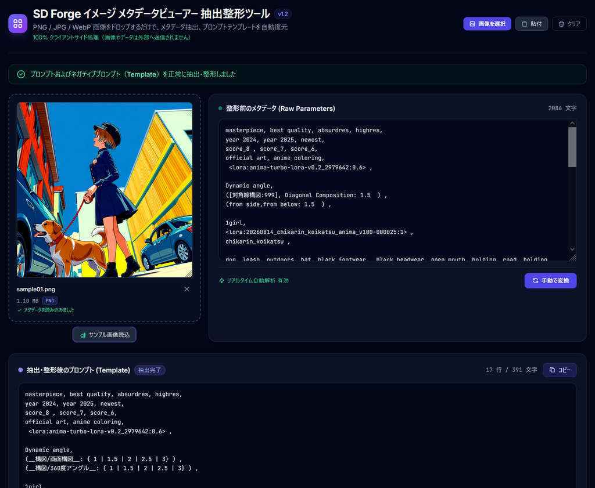

# SD Forge イメージ メタデータビューアー 抽出整形ツール

Stable Diffusion Forge Neo で生成した画像から、埋め込まれたメタデータを読み込み、プロンプトや生成パラメータを確認するためのツールです。

Forge Neo の画像メタデータには、ワイルドカードが置換されたプロンプトに加えて、置換前のテンプレートが保存されている場合があります。本ツールは後半に記録された `Template` と `Negative Template` を抽出し、エスケープされた改行などを復元して表示します。



## 公開ページ

以下のページから利用できます。

<https://keiarues.github.io/sd-forge-neo_png-info-viewer/>

## 主な機能

- `Template` と `Negative Template` の抽出・整形
- `Steps`、`Sampler`、`CFG scale`、`Seed`、`Model` などの生成パラメータ表示
- PNG、JPEG、WebP に対応
- 画像のドラッグ＆ドロップ、ファイル選択、クリップボードからの貼り付けに対応
- `TestFile_sample` のサンプル画像を読み込む「サンプル画像読込」ボタンを搭載
- 改行コードや `\n`、`\r\n`、`\t` などのエスケープ文字を復元
- すべてブラウザ内で処理するため、画像やメタデータを外部へ送信しない

## 使い方

1. 公開ページを開きます。
2. 画像を drop-zone にドラッグ＆ドロップするか、「画像を選択」から読み込みます。
3. クリップボードにコピーした画像は、「貼付」ボタンから読み込めます。
4. 機能を試す場合は、drop-zone 下の「サンプル画像読込」ボタンを押します。
5. 読み込んだメタデータが Raw Parameters に表示され、抽出結果が下のテキストボックスに表示されます。

テキスト形式のメタデータを直接確認したい場合は、Raw Parameters に貼り付けてください。入力内容は自動的に解析されます。

## 動作例

### 入力データ（メタデータ例）
```text
masterpiece, best quality, absurdres, highres,
...
Negative prompt: worst quality, ...
Steps: 15, Sampler: Res Multistep, CFG scale: 4, Seed: 2337776575, Size: 896x1152, Model: anima_baseV10, Template: "masterpiece, best quality,\n__構図/画面構図__: { 1 | 1.5 | 2 | 2.5 | 3} ,\n\n1girl,\n<lora:chikarin:1> ,\n__服装/おしゃれ着__ ,\n", Negative Template: "worst quality, low quality,\nbad anatomy,"
```

### 抽出後のプロンプト（Template）
```text
masterpiece, best quality,
__構図/画面構図__: { 1 | 1.5 | 2 | 2.5 | 3} ,

1girl,
<lora:chikarin:1> ,
__服装/おしゃれ着__ ,
```

### 抽出後のネガティブプロンプト（Negative Template）
```text
worst quality, low quality,
bad anatomy,
```

## ローカルでの利用

ビルドツールやサーバーは必要ありません。リポジトリを取得し、`index.html` をブラウザで開くだけで利用できます。

## 技術構成

- HTML5 / CSS3 / JavaScript（ES2022、Vanilla JS）
- Tailwind CSS（CDN）
- Google Fonts（Inter / JetBrains Mono）

## ファイル構成

```text
sd-forge-neo_png-info-viewer/
├── index.html              # メイン画面
├── README.md               # ドキュメント
├── css/
│   └── style.css           # スタイル、スクロールバー、アニメーション
├── js/
│   ├── constants.js        # サンプルメタデータ
│   ├── parser.js           # 画像解析とメタデータ抽出
│   └── app.js              # UI操作とファイル処理
└── TestFile_sample/        # サンプル画像・テキスト
```

## リポジトリ

<https://github.com/keiarues/sd-forge-neo_png-info-viewer>

